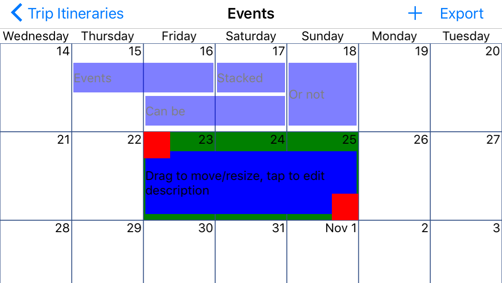

# TripSketch
Xamarin.Forms app for iOS/WinPhone to help with rapid brainstorming of travel itineraries.

**Yet another calendar app?**

Not exactly. Most calendar apps are focused on entering precise appointments for individual calendars, setting recurrence/alerts, etc. Most trip planning apps focus on sights/hotels/etc.

This app is designed more to simulate the experience of quickly penciling rough ideas on post-it notes and moving them around a wall calendar. With the added feature of being able to quickly make copies and try out itinerary variations.

It intentionally does not support specific times for events or other such advanced features. It is for rough sketches. When you reach an itinerary that you're happy with and want to further flesh out, you can export it to a device calendar.

I've traveled rather a bit, and usually start with planning multiple concurrent itineraries and comparing/varying them as I learn more about what days places are open, train schedules, how long to spend in each city, etc.

**It looks pretty ugly**

Yeah, I'm not a designer. My goal was to make it easy and efficient to use, not pretty. Design contributions are welcome.

###Tech stuff
Built with Xamarin.Forms and my Calendars API plugin (see other GitHub repo). Wrote my own MVVM supporting stuff because I felt like it. Yes I could have saved time with MVVM Cross, MVVM Light, or Xamarin.Forms.Labs... all great libraries.
